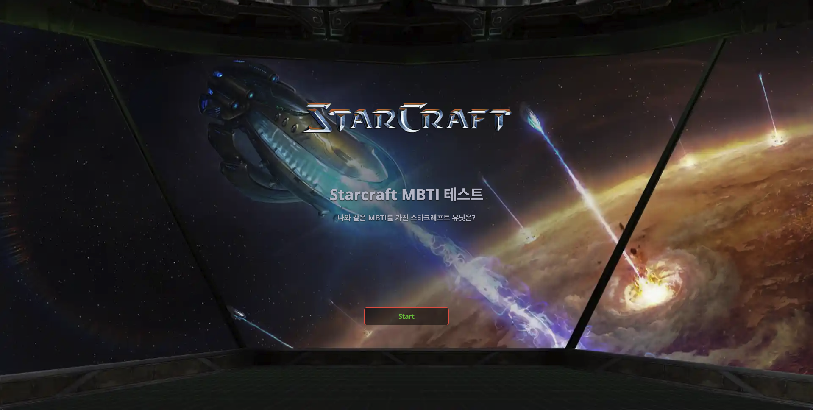
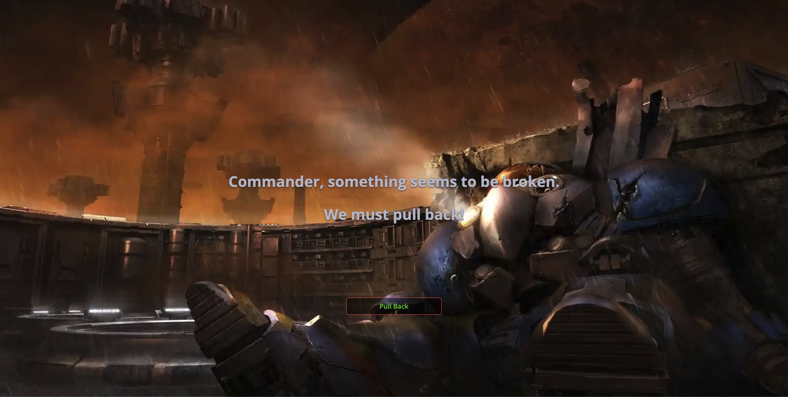
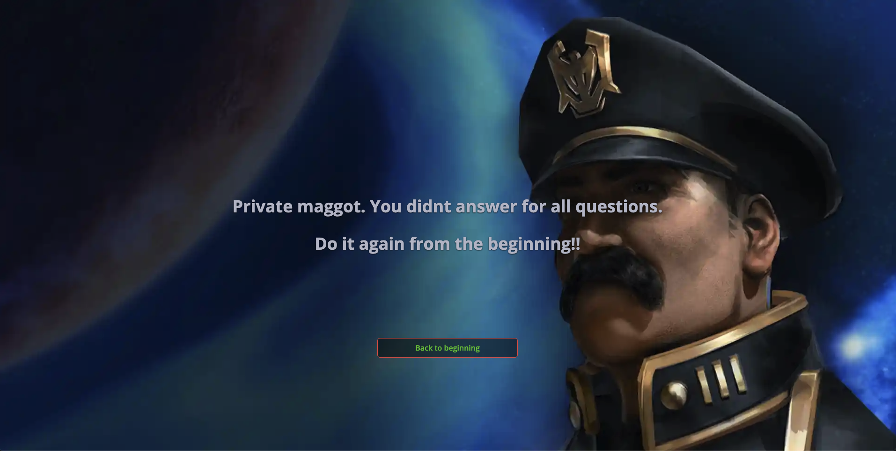
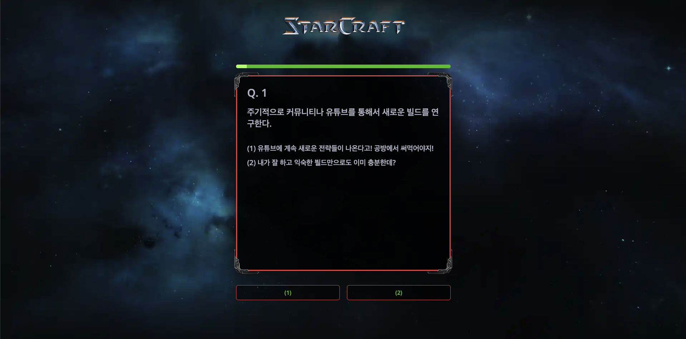
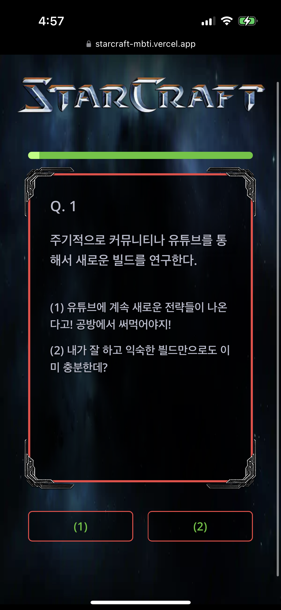
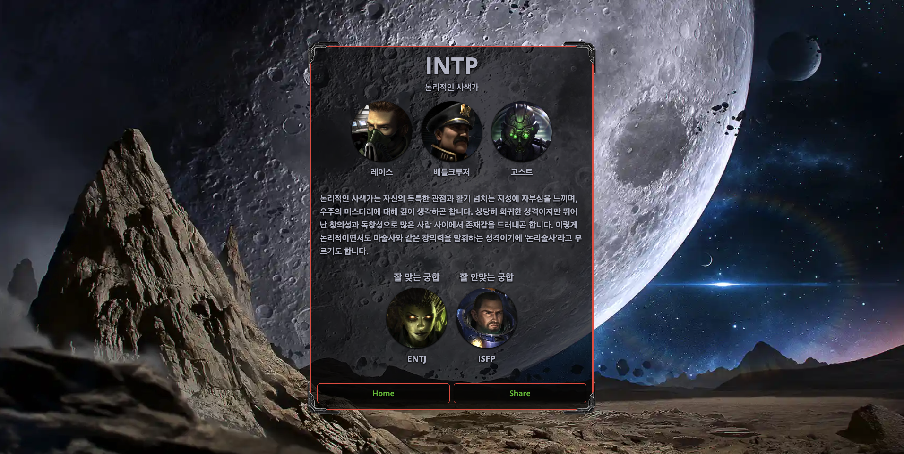

### Starcraft MBTI

😎 나와 같은 MBTI를 가진 유닛은?! [바로 확인해보기!](https://starcraft-mbti.vercel.app/)

> 제작 기간: 2024. 06. 19 ~ 2024. 06. 21

### FE

-   NextJS
-   React
-   Tailwind
-   Typescript
-   Recoil

### Deployment

-   Vercel

## Preview

### Home Page

|  |  |
| ---------------------- | ------------------------- |

### 404 Page

|  |  |
| ------------------------ | ------------------------- |

### Wroung MBTI Page

|  |  |
| ------------------------ | ------------------------- |

### Question Page

|  |  |
| ------------------------ | ------------------------- |

### Result Pate

|  |  |
| ------------------------ | ------------------------- |

### 아쉬운점

MBTI 질문에 대한 route를 각각 다르게 구조를 잡았고, 이를 SSG를 통해서 User가 Server에서 Pre-Rendered된 HTML을 내려받아 최대한 빠르게 로딩되는 과정을 보지않고 컨텐츠를 볼 수 있도록 구현했다.

먼저 User가 로딩되는 화면을 보지 않는 부분은 만족스러우나, 다음 질문으로 넘어가는 과정에서 route가 변하고 다시 다른 HTML을 보여주면서 화면이 깜빡이는 경험을 하게됐다.

16개의 각가 MBTI에 따른 결과 화면은 Pre-Rendered된 HTML로 만드니 바로 확인할 수 있어서 이점은 만족스러웠다.

추후에 비슷한 작업을 하게된다면, User가 연속적으로 인터랙티브한 작업을 해야할 경우는 route를 고정하고 CSR과 Suspense(Loading.tsx)를 적절히 사용해서 다음 질문으로 넘어갈때 깜빡이는 현상은 피해야할것 같다.

### Resources

-   Logo: [wikipedia](https://en.wikipedia.org/wiki/File:StarCraft_Logo.png)
-   Favicon: [Blizzard Game Press Center](https://blizzard.gamespress.com/ko/starcraft)
-   Background Images: [Blizzard Starcraft Remaster](https://starcraft.blizzard.com/ko-kr/)
-   Accessories Images: [Blizzard Starcraft Remaster](https://starcraft.blizzard.com/ko-kr/)
-   Characters Portraits: [BearAIMighty Game Quotes Youtube](https://www.youtube.com/@bearalmightyquotes/videos)
